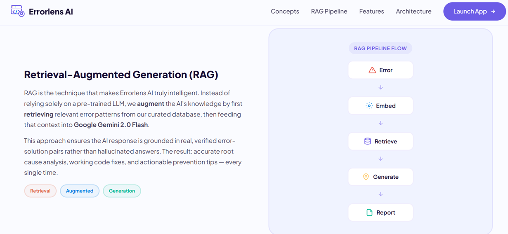
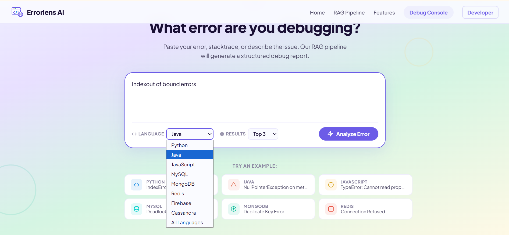

<div align="center">

  <!-- 🙏 ENDEE GREETING -->
  <h3>🙏 Thank You, Endee.io</h3>
  <p>First and foremost, thank you to the Endee team for this incredible opportunity. Building ErrorLens AI utilizing the Endee Vector Database was an amazing experience. The performance, HNSW architectural speed, and intuitive SDK made managing RAG contexts flawless.</p>
  <br>

  <!-- 🔥 SINGLE DEBUG LOGO -->
  

  <h1>⚡ ErrorLens AI</h1>
  <h3>Semantic Debugging Powered by Vector Search + RAG</h3>

  <p>
    Intelligent Error Understanding • Instant Fix Generation • Developer Productivity Booster
  </p>
  
  <p>
    <a href="https://ashok-kumar-portfolio.onrender.com" target="_blank"></a>
    
    
  </p>

</div>

<hr>

<!-- ===================================================== -->
<!-- 🎬 DEMO SECTION (LIVE VIDEO) -->
<!-- ===================================================== -->

<h2>🎬 Live Demo</h2>

<div align="center">

<div style="width:100%; padding:10px; border-radius:12px;">
  <!-- Live Video Embedded Here -->
  <video src="Results/ErrorLense_ai.mp4" autoplay loop controls muted playsinline width="90%"></video>
  <p><i>(If video does not autoplay, please hit play or right click to open video file)</i></p>
</div>

</div>

<hr>

<!-- ===================================================== -->
<!-- 🧠 INTRO SECTION -->
<!-- ===================================================== -->

<h2>🧠 What is ErrorLens AI?</h2>

<table width="100%">
<tr>
<td width="55%">

ErrorLens AI is an advanced **semantic debugging assistant** that understands errors beyond keywords.

It transforms raw stack traces into:
- Root cause analysis  
- Clean explanations  
- Step-by-step solutions  
- Language-specific highlighted Code

Using:
- **Vector Search** (Endee DB) for exact history matching
- **AI Generation** (Gemini) strictly formatted logic parsing
- **RAG Pipeline** feeding structured Context

</td>

<td width="45%" align="center">

<div style="border-radius:12px; overflow:hidden;">
  
</div>

</td>
</tr>
</table>

<hr>

<!-- ===================================================== -->
<!-- ⚙️ HOW IT WORKS -->
<!-- ===================================================== -->

<h2>⚙️ How It Works</h2>

<table width="100%">
<tr>
<td width="50%" align="center">

<div style="border-radius:12px; overflow:hidden;">
  
</div>

</td>

<td width="50%">

<br>
1️⃣ User pastes error traceback.<br>
2️⃣ Text converts to 384-dimensional **Vector Embedding**.<br>
3️⃣ Search runs via Cosine similarity natively inside **Endee DB**.<br>
4️⃣ Retrieve similar historical errors + resolutions.<br>
5️⃣ Send raw retrieved context directly to **Google Gemini**.<br>
6️⃣ Generator crafts and structures the solution HTML UI output.<br>

</td>
</tr>
</table>

<hr>

<!-- ===================================================== -->
<!-- 🚀 FEATURES -->
<!-- ===================================================== -->

<h2>🚀 Key Features</h2>

<table width="100%">
<tr>

<td align="center">
<h4>⚡ Instant Debugging</h4>
<p>Get reliable fixes backed by datasets within milliseconds</p>
</td>

<td align="center">
<h4>🧠 Semantic Search</h4>
<p>Understands meaning and code logic, ignoring generic keyword typos</p>
</td>

<td align="center">
<h4>🌍 Multi-Language</h4>
<p>Python (200+), Java (180+), JavaScript (250+), and SQL Databases!</p>
</td>

</tr>
</table>

<br>

<div align="center">

<div style="width:90%; border-radius:12px; overflow:hidden;">
  
</div>

</div>

<hr>

<!-- ===================================================== -->
<!-- 📊 RESULTS SECTION (GALLERY) -->
<!-- ===================================================== -->

<h2>📊 Debug Results Preview</h2>

<div align="center">

<p>A look at the incredibly structured UI output detailing code, explanations, and Endee similarity match percentages:</p>

<div style="width:90%; padding:10px; border-radius:12px;">
  
</div>
<br>

<div style="width:90%; padding:10px; border-radius:12px;">
  
</div>
<br>

<div style="width:90%; padding:10px; border-radius:12px;">
  
</div>
<br>

<div style="width:90%; padding:10px; border-radius:12px;">
  
</div>
<br>

<div style="width:90%; padding:10px; border-radius:12px;">
  
</div>

</div>

<hr>

<!-- ===================================================== -->
<!-- 🏗️ ARCHITECTURE -->
<!-- ===================================================== -->

<h2>🏗️ System Architecture</h2>

<div align="center">

<div style="width:90%; border-radius:12px; padding: 20px;">
```text
┌────────────────────────────────────────────────────────┐
│                   ERRORLENS AI                         │
│                                                        │
│  User Input (Error Trace)                              │
│         │                                              │
│         ▼                                              │
│  ┌──────────────────────────────────────────┐          │
│  │             FastAPI Backend              │          │
│  │                                          │          │
│  │  1. /search ──► Embed ──► Endee Query    │          │
│  │  2. /rag    ──► Context + LLM ──► Report │          │
│  └──────┬──────────────────────┬────────────┘          │
│         │                      │                       │
│         ▼                      ▼                       │
│  ┌──────────────┐      ┌──────────────┐                │
│  │ Endee Vector │      │ Google       │                │
│  │ Database     │      │ Gemini AI    │                │
│  │ (Docker)     │      │ (RAG Engine) │                │
│  └──────────────┘      └──────────────┘                │
│         │                      │                       │
│   Semantic Matches + Structured HTML/JSON Debug Output │
└────────────────────────────────────────────────────────┘
```
</div>

</div>

<hr>

<!-- ===================================================== -->
<!-- ⚡ TECH STACK -->
<!-- ===================================================== -->

<h2>⚡ Tech Stack</h2>

<table width="100%">
<tr>

<td align="center">
<b>Frontend</b><br>
HTML • CSS • Vanilla JS
</td>

<td align="center">
<b>Backend API</b><br>
Python • FastAPI
</td>

<td align="center">
<b>Vector DB</b><br>
Endee (HNSW Engine)
</td>

<td align="center">
<b>AI Engine</b><br>
Google Gemini 2.0
</td>

</tr>
</table>

<hr>

<!-- ===================================================== -->
<!-- ⚙️ SETUP -->
<!-- ===================================================== -->

<h2>⚙️ Quick Setup</h2>

<pre>
# 1. Clone your implementation
git clone https://github.com/ashokkumarboya93/endee.git
cd endee

# 2. Spin up the Endee DB isolated Server
docker compose up -d

# 3. Setup local python workspace
cd debugbot
python -m venv venv
pip install -r requirements.txt

# 4. Integrate your LLM token
# Add .env file inside debugbot/api/ (.env content: GEMINI_API_KEY=your_key)

# 5. Populate Endee using 700+ vectors
python -m ingest.loader

# 6. Launch the App interface on localhost:8000
python -m uvicorn api.main:app --host 0.0.0.0 --port 8000 --reload
</pre>

<hr>

<!-- ===================================================== -->
<!-- 🌟 FOOTER -->
<!-- ===================================================== -->

<div align="center">

<h3>🌟 ErrorLens AI</h3>

<p>
Built specifically for <b>Endee.io Evaluation</b> • Semantic Debugging Engine
</p>

</div>
