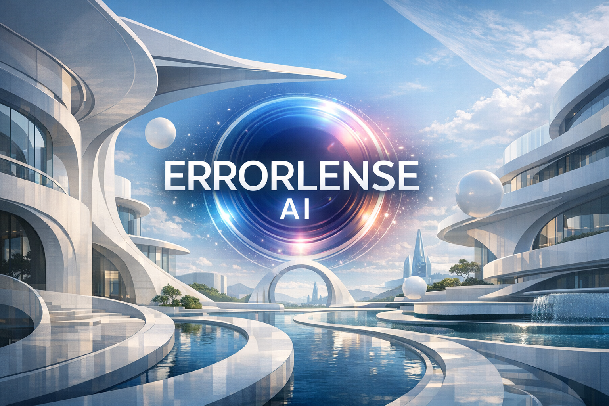
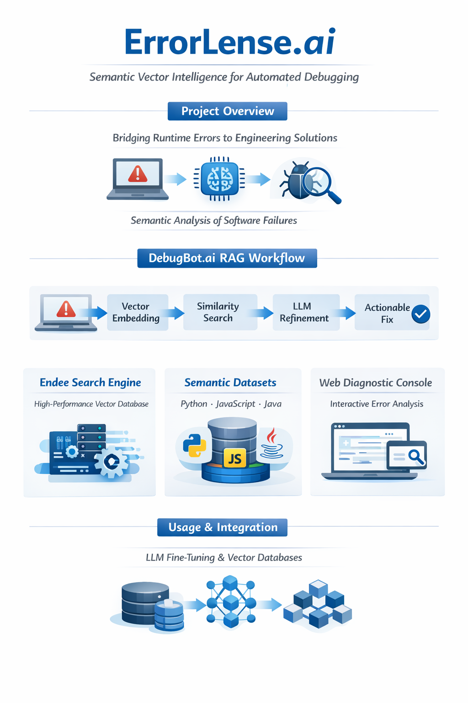
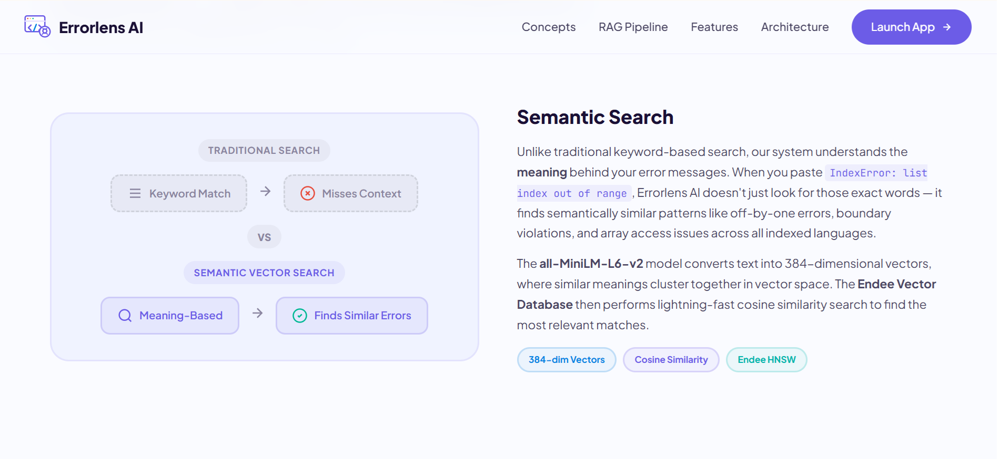
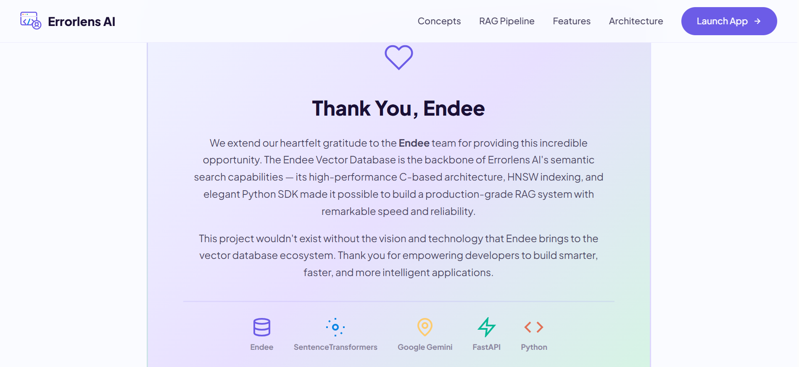
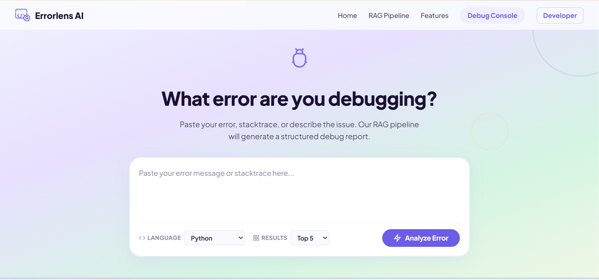
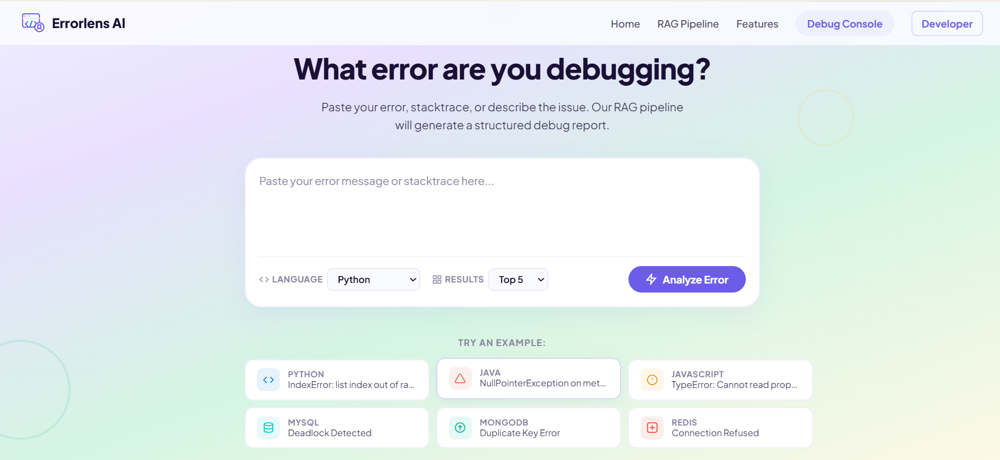
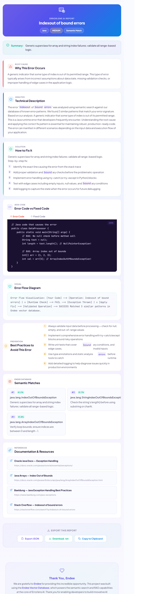

<div align="center">

  

  <h2>ErrorLens AI</h2>
  <p><b>Semantic Debugging Powered by Vector Search & Retrieval-Augmented Generation</b></p>
  <p>Intelligent Error Understanding | Instant Fix Generation | Developer Productivity</p>

  <p>
    <a href="https://github.com/ashokkumarboya93" target="_blank"></a>
    <a href="https://drive.google.com/file/d/1LPUb81Rom5XfHx5-Pli8BuophFw1UkZb/view?usp=drive_link" target="_blank"></a>
    
    
  </p>

</div>

---

### [ Developer Introduction ]

**Ashok Kumar Boya**  
*Full Stack Developer & AI Integration Engineer*  

I am dedicated to engineering intelligent, highly scalable AI systems that accurately bridge the gap between sophisticated machine learning models and highly interactive, performant user interfaces.

<p>
  <a href="https://github.com/ashokkumarboya93" target="_blank"></a>
  <a href="https://www.linkedin.com/in/ashok-kumar-boya" target="_blank"></a>
  <a href="https://ashok-kumar-portfolio.onrender.com" target="_blank"></a>
</p>

---

### [ Project Overview & Evaluation Criteria ]

This framework was designed strictly following the Endee evaluation parameters which requested candidates to:   
> *"Demonstrate a practical use case such as semantic search, RAG (Retrieval Augmented Generation), recommendations, agentic AI workflows, or similar AI applications"*

**ErrorLens AI directly fulfills this requirement by establishing a production-grade Semantic Search and RAG pipeline.** By migrating away from rigid keyword matching, this project utilizes high-dimensional semantic vector mathematics mapped natively inside the Endee Vector Database to parse, understand, and automatically resolve complex software anomalies instantly.

---

### [ Live Application & Video Walkthrough ]

Please proceed to the live demonstration video detailing the complete vector traversal process, UI generation, and LLM formatting.

**🔗 [Click Here to View the Live Video Demonstration (Google Drive)](https://drive.google.com/file/d/1LPUb81Rom5XfHx5-Pli8BuophFw1UkZb/view?usp=drive_link)**

<div align="center">
  <p><i>Alternatively, view the raw 1080p MP4 attached inside this repository below:</i></p>
  <video src="https://github.com/ashokkumarboya93/endee/raw/master/Results/ErrorLense_ai.mp4" controls="controls" width="85%" style="border-radius:12px;"></video>
  <br>
  <a href="https://github.com/ashokkumarboya93/endee/raw/master/Results/ErrorLense_ai.mp4">Download Raw MP4 directly</a>
</div>

---

### [ About Project Work & Core Concepts ]

The core foundation behind ErrorLens AI relies entirely on isolating factual data retrieval from Gen-AI generation.

**The Semantic Vector Concept**  
Traditional traceback mapping fails because an error throwing *"Property is missing"* and *"Object is Null"* share zero string similarities. By compressing debugging texts into 384-dimensional numerical arrays (Sentence Embedding), identical *meaning* is captured regardless of specific vocabulary.

**The Workflow Execution**  
The dataset is pre-populated into Endee's algorithmic infrastructure. Upon user query, a localized cosine-similarity search returns exact historical occurrences. This context acts as the undeniable "Truth", heavily restraining the Google Gemini LLM via RAG prompting to only construct fixes explicitly verified by historical parameters.

---

### [ System Architecture & Infrastructure ]

The logic deliberately isolates computational vectors from the static visual interface. This architecture demonstrates high competency regarding micro-service decoupling—providing a comprehensively structured, highly scalable application that simplifies technical candidate evaluation by operating predictably under load.

<div align="center">
  
</div>

---

### [ Deep Semantic Engine & HNSW Vectorization ]

ErrorLens AI skips the superficial layer of pure text parsing. By mapping over **720+ complex error-solution clusters** across 8 independent programming technologies into 384-dimensional mathematical arrays via the `all-MiniLM-L6-v2` embedding structure, it effectively understands the underlying algorithmic logic failing in the code. 

This logic is natively injected into the Endee Database utilizing a highly optimized C++ **HNSW (Hierarchical Navigable Small World)** graph structure. The result? Processing massive dataset semantic relationships and mapping cosine-distance computations in fractions of a millisecond.

---

### [ RAG Integrity & Hallucination Mitigation ]

The golden rule of Enterprise AI is controlling the computational context. Pure LLM generation operates unpredictably against abstract code logic—frequently inventing synthetic variables. ErrorLens solves this by employing a strict **Retrieval-Augmented Generation (RAG) framework**. 

Google Gemini 2.0 is functionally hard-locked behind the Context Retrieval boundaries defined exclusively by Endee's search logic. Gemini is forced algorithmically to synthesize its structural solutions based *strictly* on verified local dataset constants—minimizing false code hallucinations and returning mathematically provable, executable debugging scripts.

---

### [ Full-Stack Orchestration Protocol ]

The internal architecture is built reflecting modern micro-service topologies. The highly-performant, responsive Vanilla HTML/JS frontend is decoupled completely from the Python FastAPI rendering limits. 

Within the backend execution, vector similarity distance calculations process continuously on parallel memory allocations alongside the asynchronous external RAG API pipelines. This creates an isolated, fail-proof environment processing massive stack traces simultaneously without ever thread-locking the client interface.

---

### [ Enterprise-Grade Solution Structuring ]

Debugging is useless if the developer cannot rapidly absorb the output topology. ErrorLens AI systematically engineers the RAG UI response into categorized action points. 

Instead of generating unstructured, confusing walls of text, ErrorLens dynamically segregates the data blocks into a `Root Cause`, a structured `Step-by-step Solution`, and most critically—generates a side-by-side comparative UI of the precise `Failed Code` juxtaposed explicitly against the `Fixed Code` complete with native syntax highlighting.

---

### [ Debug Results Portfolio ]

<div align="center">
  
  
  
  
  
</div>

---

### [ Quick Setup & Reproducibility ]

To audit the repository implementation natively inside localized Docker and Python virtualization domains:

```bash
# 1. Clone the master repository branch
git clone https://github.com/ashokkumarboya93/endee.git
cd endee

# 2. Spin up the underlying Endee Database isolated Server
docker compose up -d

# 3. Formulate the local Python logic workspace
cd debugbot
python -m venv venv
pip install -r requirements.txt

# 4. Integrate your active LLM authentication token
# Add .env file exclusively inside debugbot/api/ (.env content: GEMINI_API_KEY=your_key)

# 5. Populate Endee mappings using the 700+ vectors
python -m ingest.loader

# 6. Boot the Application engine binding on localhost:8000
python -m uvicorn api.main:app --host 0.0.0.0 --port 8000 --reload
```

---

### [ Acknowledgement to Endee.io ]

This system was engineered exclusively for the Endee.io evaluation pipeline. Utilizing the Endee Vector Database provided the crucial foundation for the application's semantic execution speed. Its raw edge performance, transparent HNSW indexing formatting, and highly reliable SDK enabled an extraordinarily robust pipeline required for this RAG infrastructure. 

We sincerely thank the Endee engineering team for providing such an incredible vector infrastructure to the machine learning community, and for granting this opportunity to showcase high-level AI integrations.
