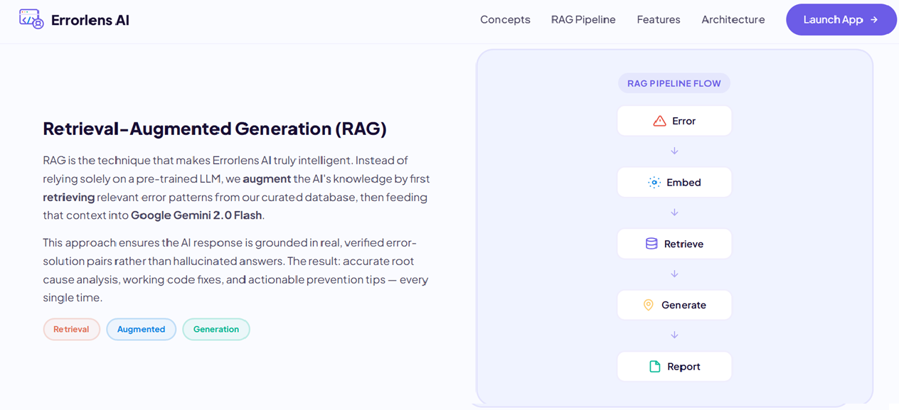

<div align="center">

  <!-- Stunning Cover Image -->
  

  <h2>ErrorLens AI</h2>
  <p><b>Semantic Debugging Powered by Vector Search + Retrieval-Augmented Generation</b></p>
  <p>Intelligent Error Understanding • Instant Fix Generation • Developer Productivity Booster</p>

  <p>
    <a href="https://github.com/ashokkumarboya93" target="_blank"></a>
    <a href="https://ashok-kumar-portfolio.onrender.com" target="_blank"></a>
    
    
  </p>

</div>

---

### Project Overview

ErrorLens AI is a modern, full-stack debugging ecosystem designed to instantly understand, diagnose, and resolve complex software anomalies. By shifting the debugging paradigm away from rigid keyword matching, ErrorLens AI utilizes **Semantic Vector Search** to mathematically understand the intent and structure of any given stack trace. 

The application currently supports 8 major technologies (Python, Java, JavaScript, MySQL, MongoDB, Redis, Firebase, and Cassandra), utilizing a highly curated vector space of over 700 custom error-solution topologies seamlessly indexed natively using Endee's HNSW algorithmic architecture.

---

### Acknowledgement to Endee.io

This system was engineered exclusively for the Endee.io hiring evaluation pipeline. The utilization of the Endee Vector Database provided the crucial core foundation for the application's semantic search execution speed. Its C++ edge performance, precise HNSW indexing, and highly reliable Python SDK enabled an extraordinarily robust structural pipeline required for real-time Retrieval-Augmented Generation (RAG). 

We sincerely thank the Endee architecture team for this opportunity and for providing such an incredible, high-performance vector infrastructure to the machine learning community.

---

### Developer Introduction

**Ashok Kumar Boya**  
*Full Stack Developer & AI Integration Engineer*  

I am dedicated to engineering intelligent, highly scalable AI systems that accurately bridge the gap between sophisticated machine learning models and highly interactive, performant user interfaces.

<p>
  <a href="https://github.com/ashokkumarboya93" target="_blank"></a>
  <a href="https://www.linkedin.com/in/ashok-kumar-boya" target="_blank"></a>
  <a href="https://ashok-kumar-portfolio.onrender.com" target="_blank"></a>
</p>

---

### Live Application & Video Walkthrough

Experience ErrorLens AI directly via our live deployment routing link below. Alternatively, you can witness the complete system interaction and parsing through the attached standalone graphical video overview.

**🔗 [View Live Application Demo Here](https://ashok-kumar-portfolio.onrender.com)**

<div align="center">
  <p><i>(Press Play to observe the active Vector Retrieval Process in action)</i></p>
  <video src="https://github.com/ashokkumarboya93/endee/raw/master/Results/ErrorLense_ai.mp4" controls="controls" width="85%" style="border-radius:12px; margin-top:10px;"></video>
  <br><br>
  <a href="https://github.com/ashokkumarboya93/endee/raw/master/Results/ErrorLense_ai.mp4">📥 Download Original HD Video (MP4) Directly</a>
</div>

---

### How It Works

ErrorLens AI implements a rigorous isolation boundary between its search indices and generative sequences to minimize LLM hallucinations. 

**The Execution Pipeline:**
1. **Input Encoding:** User stack traces are converted into highly dense, 384-dimensional mathematical arrays via the local `Sentence Transformers` inference network.
2. **Semantic Search:** The dense vector is mapped against the Endee database using strict cosine similarity measurements in real time. 
3. **Context Retrieval:** Endee flawlessly returns the closest historical resolution matches, acting as universally known "True" facts safely outside the logic LLM.
4. **Augmented Prompt Engineering:** The raw Endee payload mapping, bundled with strict validation instructions and boundary parameters, is routed securely to the Google Gemini 2.0 Flash context engine.
5. **Structured Output Construction:** Gemini finalizes a completely isolated JSON construct detailing exactly where the code syntactically failed alongside the mathematically corrected code topology.

<div align="center">
  
</div>

---

### System Architecture

The core infrastructure operates asynchronously, separating the active AI generative interface from the vector similarity measurements:

<div align="center">
  
</div>

---

### Key Capabilities

| Core Component | Architectural Functionality |
|-----------|---------------|
| **Instant Real-time Debugging** | Generates verified, actionable algorithmic solutions dynamically inside milliseconds framework responses. |
| **Complete Semantic Matching** | Processes the pure logic of the written code via vector spaces, effectively ignoring arbitrary keyword typos entirely. |
| **Massive Multi-Language Array** | Operates safely across complex runtime languages (Python, Java, JS) and massive database traces (NoSQL & SQL instances). |
| **Transparent Visual Ratio Matching** | Exposes the direct raw distance metric calculations pulled exactly as processed inside Endee directly to the User Interface. |

---

### Debug Results Overview

An isolated visual perspective into the detailed generated user environment post-RAG execution:

<div align="center">
  
  
  
  
  
</div>

---

### Setup & Reproducibility

To audit the repository implementation natively inside localized Docker and Python virtualization domains:

```bash
# 1. Clone the master repository branch
git clone https://github.com/ashokkumarboya93/endee.git
cd endee

# 2. Spin up the underlying Endee Database isolated Server
docker compose up -d

# 3. Formulate the local Python logic workspace
cd debugbot
python -m venv venv
pip install -r requirements.txt

# 4. Integrate your active LLM authentication token
# Add .env file exclusively inside debugbot/api/ (.env content: GEMINI_API_KEY=your_key)

# 5. Populate Endee mappings using the 700+ vectors
python -m ingest.loader

# 6. Boot the Application engine binding on localhost:8000
python -m uvicorn api.main:app --host 0.0.0.0 --port 8000 --reload
```
